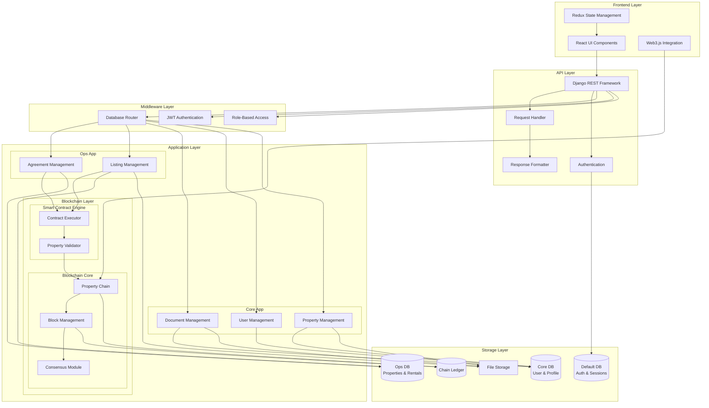

# TrustRent System Architecture

## High-Level Architecture Diagram

## Component Description

### Frontend Layer
- **Redux State Management**: Centralized state management for the React application
- **React UI Components**: User interface components and views
- **Web3.js Integration**: Blockchain interaction and wallet connectivity

### API Layer
- **Django REST Framework**: Main API framework handling requests and responses
- **Request Handler**: Processes incoming API requests
- **Response Formatter**: Standardizes API responses
- **Authentication**: Handles user authentication

### Middleware Layer
- **Database Router**: Routes database operations to appropriate databases
- **JWT Authentication**: Token-based authentication system
- **Role-Based Access**: Permission and access control system

### Application Layer

#### Ops App
- **Agreement Management**: Handles rental and purchase agreements
- **Listing Management**: Manages property listings and searches

#### Core App
- **Document Management**: Handles document storage and verification
- **User Management**: User profiles and account management
- **Property Management**: Property registration and ownership

#### Blockchain Layer
- **Smart Contract Engine**
  - Contract Executor: Executes property and rental smart contracts
  - Property Validator: Validates property ownership and transactions

- **Blockchain Core**
  - Property Chain: Maintains property ownership chain
  - Block Management: Handles blockchain blocks
  - Consensus Module: Manages consensus mechanism

### Storage Layer
- **Default DB**: Authentication and session data
- **Core DB**: User profiles and core application data
- **Ops DB**: Property listings and rental agreements
- **Chain Ledger**: Blockchain transaction data
- **File Storage**: Document and media storage

## Data Flow

1. **User Interaction Flow**
   - User interacts with React UI
   - Redux manages state
   - API requests through Django REST Framework
   - Middleware processes requests
   - Routed to appropriate application module

2. **Blockchain Interaction Flow**
   - Web3.js connects to blockchain
   - Smart contracts executed through Contract Executor
   - Validated by Property Validator
   - Recorded in Property Chain
   - Managed by Block Management
   - Consensus achieved through Consensus Module

3. **Data Storage Flow**
   - Authentication data in Default DB
   - User and property data in Core DB
   - Operational data in Ops DB
   - Blockchain data in Chain Ledger
   - Documents and media in File Storage

## Architectural Components Breakdown

### 1. Frontend Layer
- **Redux State Management**
  - Centralized application state
  - User session handling
  - Real-time updates
  
- **React UI Components**
  - Responsive design
  - Material-UI/Tailwind CSS
  - Component-based architecture
  
- **Web3.js Integration**
  - Blockchain wallet connection
  - Smart contract interaction
  - Transaction handling
  
### 2. API Layer
- **Django REST Framework**
  - RESTful API endpoints
  - API versioning
  - Response serialization
  
- **Request Handler**
  - Input validation
  - Request processing
  - Error handling
  
- **Response Formatter**
  - Data serialization
  - Response standardization
  - Error formatting

### 3. Middleware Layer
- **Database Router**
  - Multi-database routing
  - Cross-database relationships
  - Query optimization
  
- **JWT Authentication**
  - Token-based auth
  - Session management
  - Security middleware
  
- **Role-Based Access**
  - Permission management
  - Access control
  - Role hierarchy

### 4. Application Layer

#### Core App
- **User Management**
  - Profile handling
  - Identity verification
  - Role management
  
- **Document Management**
  - File uploads
  - Document verification
  - Storage management
  
- **Property Management**
  - Property registration
  - Ownership tracking
  - Property details

#### Ops App
- **Listing Management**
  - Property listings
  - Search functionality
  - Listing verification
  
- **Agreement Management**
  - Contract generation
  - Payment processing
  - Terms management

#### Blockchain Layer
- **Smart Contract Engine**
  - Contract execution
  - Property validation
  - Transaction processing
  
- **Blockchain Core**
  - Block management
  - Consensus handling
  - Chain maintenance

### 5. Storage Layer
- **Default Database**
  - Authentication data
  - Sessions
  - System settings
  
- **Core Database**
  - User profiles
  - Property records
  - Documents metadata
  
- **Ops Database**
  - Listings
  - Agreements
  - Transactions
  
- **Chain Ledger**
  - Blockchain data
  - Smart contracts
  - Transaction history
  
- **File Storage**
  - Documents
  - Images
  - Property files

## Database Relations and Routing

The system uses Django's database routing mechanism to manage multiple databases:
- Each app is assigned to its specific database
- Cross-database relationships are managed through the router
- Core database can relate to all other databases
- Test environment uses a unified database
- Migrations are controlled per database

## Security Considerations

1. **Database Isolation**
   - Separate sensitive data
   - Controlled cross-database access
   - Dedicated blockchain data storage

2. **Authentication Flow**
   - JWT token management
   - Session handling in default database
   - Role-based permissions across apps

3. **Data Access Control**
   - Database-level access control
   - Application-level permissions
   - Cross-database relation validation

## Scalability Approach

1. **Vertical Scaling**
   - Database optimization
   - Query performance tuning
   - Resource allocation

2. **Caching Strategy**
   - Database query caching
   - Session caching
   - Static file caching

## Monitoring and Logging

1. **Database Monitoring**
   - Per-database metrics
   - Query performance
   - Connection pooling

2. **Application Logging**
   - Cross-database operations
   - Authentication events
   - Blockchain transactions 