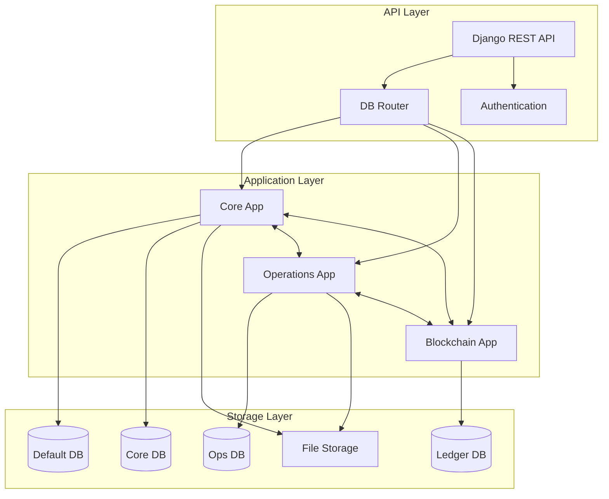

# TrustRent Backend Architecture



## Layer Descriptions

### API Layer
- **Django REST API**: Handles all incoming requests and response formatting
- **DB Router**: Manages database routing for multi-database setup
- **Authentication**: JWT and role-based access control

### Application Layer

1. **Core App**
   - User management
   - Property management
   - Document handling
   - Identity verification

2. **Operations App**
   - Property listings
   - Rental agreements
   - Reviews
   - Transaction management

3. **Blockchain App**
   - Smart contracts
   - Property verification
   - Transaction recording
   - Chain management

### Storage Layer
- **Default DB**: Authentication and sessions
- **Core DB**: User and property data
- **Ops DB**: Listings and agreements
- **Ledger DB**: Blockchain records
- **File Storage**: Documents and media

## Key Workflows

1. **Property Registration**
   ```
   Core App → Blockchain App → Ledger DB
   ```

2. **Listing Creation**
   ```
   Operations App → Core App → Ops DB
   ```

3. **Agreement Processing**
   ```
   Operations App → Blockchain App → Ledger DB
   ```

4. **User Verification**
   ```
   Core App → Default DB/Core DB
   ``` 