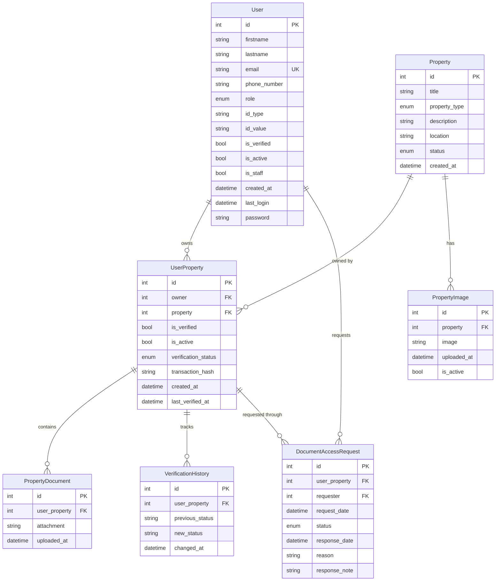

# Core Database Schema



## Model Descriptions

### User
Extended AbstractBaseUser with PermissionsMixin:
- Personal information (firstname, lastname, email)
- Role-based access (property_owner, property_seeker, land_commission_rep, sys_admin)
- Identity verification fields
- Authentication status

### Property
Property listing information:
- Basic property details
- Type classification (1-5 bedroom, gated house)
- Status tracking (available, rented, unlisted)
- Location information

### UserProperty
Links users to their properties:
- Ownership verification
- Blockchain transaction tracking
- Status management
- Verification timestamps

### PropertyImage
Property media management:
- Image storage
- Active status tracking
- Upload tracking

### PropertyDocument
Property documentation:
- Title deed storage
- Document tracking
- Association with ownership

### VerificationHistory
Tracks property verification changes:
- Status change history
- Timestamp tracking
- Audit trail

### DocumentAccessRequest
Manages document access requests:
- Request tracking
- Status management (pending, approved, denied)
- Request/response documentation

## Key Relationships

1. **User - UserProperty**
   - One-to-Many: User can own multiple properties
   - Ownership verification tracking
   - Active status management

2. **Property - UserProperty**
   - One-to-Many: Property can have ownership history
   - Current ownership tracking
   - Status management

3. **Property - PropertyImage**
   - One-to-Many: Property can have multiple images
   - Active image management
   - Upload tracking

4. **UserProperty - PropertyDocument**
   - One-to-Many: Ownership can have multiple documents
   - Document verification
   - Upload history

5. **UserProperty - VerificationHistory**
   - One-to-Many: Tracks verification status changes
   - Audit trail
   - Timestamp tracking

6. **UserProperty - DocumentAccessRequest**
   - One-to-Many: Multiple access requests per property
   - Request management
   - Access control

## Enumerations

1. **User Roles**
   ```python
   ROLE_CHOICES = [
       ('property_owner', 'Property Owner'),
       ('property_seeker', 'Property Seeker'),
       ('land_commission_rep', 'Land Commission Rep'),
       ('sys_admin', 'System Admin')
   ]
   ```

2. **Property Types**
   ```python
   PROPERTY_TYPE_CHOICES = [
       ('1_bedroom', '1 Bedroom'),
       ('2_bedroom', '2 Bedroom'),
       ('3_bedroom', '3 Bedroom'),
       ('4_bedroom', '4 Bedroom'),
       ('5_bedroom', '5 Bedroom'),
       ('gated_house', 'Full Gated House')
   ]
   ```

3. **Property Status**
   ```python
   STATUS_CHOICES = [
       ('available', 'Available'),
       ('rented', 'Rented'),
       ('unlisted', 'Unlisted')
   ]
   ```

4. **Verification Status**
   ```python
   VERIFICATION_STATUS = [
       ('pending', 'Pending'),
       ('approved', 'Approved'),
       ('rejected', 'Rejected')
   ]
   ```

## Indexes and Constraints

1. **Unique Constraints**
   - User email
   - UserProperty (owner, property) combination
   - DocumentAccessRequest (user_property, requester, status)

2. **Indexes**
   - DocumentAccessRequest: [user_property, requester, status]
   - DocumentAccessRequest: [status, request_date]
   - VerificationHistory: ordered by changed_at DESC

3. **Foreign Key Constraints**
   - Cascade deletion where appropriate
   - Proper relationship management
   - Referential integrity 