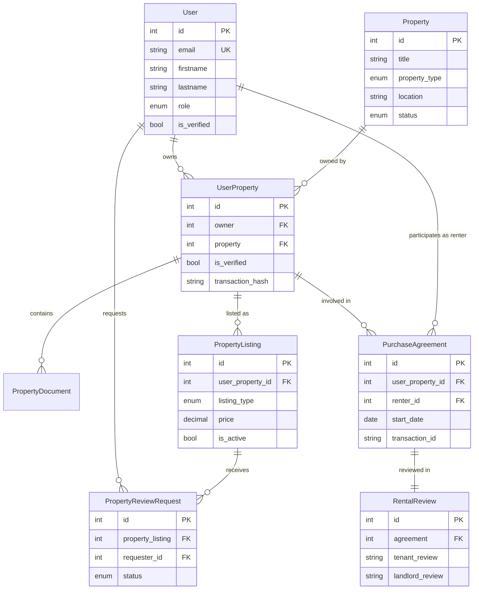

# Cross-Database Relationships



## Key Cross-Database Flows

1. **Property Listing Flow**
   ```
   User (Core) → UserProperty (Core) → PropertyListing (Ops)
   ```
   - Owner lists their verified property
   - Property must exist and be verified in core DB
   - Listing created in ops DB

2. **Property Viewing Flow**
   ```
   User (Core) → PropertyReviewRequest (Ops) → PropertyListing (Ops) → UserProperty (Core)
   ```
   - Potential renter/buyer requests viewing
   - Request linked to both user and property
   - Owner notified through core user system

3. **Purchase/Rental Agreement Flow**
   ```
   UserProperty (Core) → PurchaseAgreement (Ops) → RentalReview (Ops)
   ```
   - Verified property ownership required
   - Agreement links both owner and renter
   - Reviews tied to completed agreements

## Database Router Handling

1. **Read Operations**
   - Core DB: User and property verification
   - Ops DB: Listing and agreement management
   - Cross-database joins handled by router

2. **Write Operations**
   - Core DB: Property ownership and verification
   - Ops DB: Listings, requests, and agreements
   - Transactions isolated per database

3. **Relationship Management**
   - Foreign keys across databases
   - Integrity maintained through application logic
   - Consistent ID references

## Key Business Rules

1. **Property Listing**
   - Only verified UserProperty can be listed
   - One active listing per UserProperty
   - Owner must be verified user

2. **Review Requests**
   - Only active listings can receive requests
   - Requester must be verified user
   - One active request per user per listing

3. **Agreements**
   - Property must be verified in core DB
   - Both parties must be verified users
   - One active agreement per property

## Data Consistency Rules

1. **ID References**
   - Core IDs must exist before ops references
   - Deletion cascades within each database
   - Cross-database integrity checks

2. **Status Synchronization**
   - Property status affects listing availability
   - Agreement status affects property availability
   - User verification affects all operations

3. **Transaction Management**
   - Atomic operations within each database
   - Cross-database operations through application logic
   - Blockchain transaction tracking 