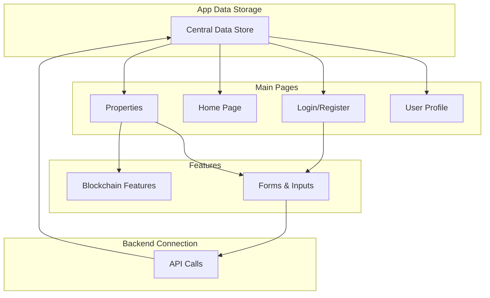

# TrustRent Frontend Architecture

## What is Redux?
Think of Redux as a central storage box for your application's data. Just like a bank keeps track of everyone's money in one place, Redux keeps track of all your application's important information in one place. This includes:
- Who is logged in
- What properties are being shown
- What page you're on
- Any important user data

Instead of each part of your app managing its own data, everything goes through this central "storage box", making it easier to keep track of changes and updates.



## Simple Structure

### Pages
1. **Login/Register**
   - Where users sign in or create account
   - Handles authentication

2. **Home Page**
   - Main landing page
   - Shows important information

3. **Properties**
   - List of properties
   - Property details
   - Add/Edit properties

4. **User Profile**
   - User information
   - Settings
   - Documents

### Features
1. **Blockchain Features**
   - Wallet connection
   - Property verification

2. **Forms & Inputs**
   - User input handling
   - Data validation
   - File uploads

### How Data Flows
1. **User Actions**
   ```
   User does something → Update central store → Update screen
   ```

2. **Loading Data**
   ```
   Request data → API call → Store data → Show on screen
   ```

3. **Saving Data**
   ```
   User submits form → Validate → Send to API → Update store
   ```

This is a simplified version of how your frontend works. Everything revolves around:
- Pages that users see
- Features they can use
- A central place to store data
- Connection to the backend

Would you like me to explain any part in more detail? 