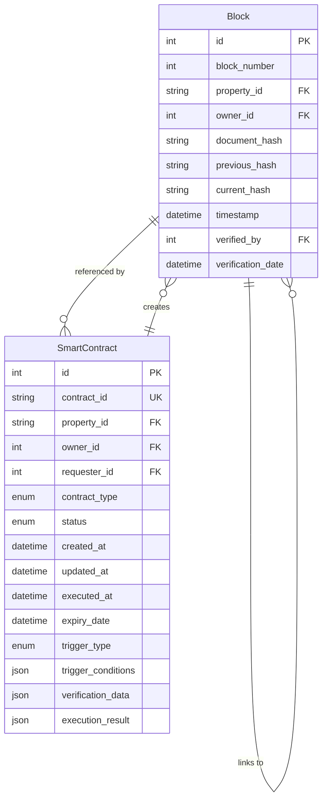

# Ledger Database Schema



## Model Descriptions

### Block
Represents a block in the TrustChain blockchain:
- Sequential block numbering
- Property ownership records
- Document verification hashes
- Chain linking through hashes
- Verification timestamps

### SmartContract
Manages automated property transactions:
- Contract lifecycle management
- Multiple contract types
- Event-driven execution
- Verification rules
- Execution tracking

## Enumerations

1. **Contract Status**
   ```python
   CONTRACT_STATUS = [
       ('created', 'Created'),
       ('pending_verification', 'Pending Verification'),
       ('verified', 'Verified'),
       ('rejected', 'Rejected'),
       ('expired', 'Expired')
   ]
   ```

2. **Contract Types**
   ```python
   CONTRACT_TYPES = [
       ('ownership_verification', 'Ownership Verification'),
       ('property_transfer', 'Property Transfer'),
       ('document_verification', 'Document Verification')
   ]
   ```

3. **Trigger Types**
   ```python
   TRIGGER_TYPES = [
       ('time', 'Time-based'),
       ('event', 'Event-based'),
       ('condition', 'Condition-based')
   ]
   ```

## Key Features

1. **Blockchain Implementation**
   - Immutable block chain
   - Hash-based integrity
   - Sequential block numbering
   - Document verification

2. **Smart Contract System**
   - Automated execution
   - Multiple trigger types
   - State machine pattern
   - Event tracking

3. **Property Verification**
   - Ownership tracking
   - Document validation
   - Transaction history
   - Multi-party verification

## Cross-Database Integration

1. **Core Database References**
   - User IDs (owner_id, requester_id, verified_by)
   - Property IDs
   - Document references

2. **Operations Database Integration**
   - Transaction verification
   - Ownership transfers
   - Agreement validation

## Key Workflows

1. **Property Registration**
   ```
   Document Hash → Block Creation → Chain Update → Ownership Record
   ```
   - Document hash generation
   - Block creation and linking
   - Ownership recording
   - Verification timestamping

2. **Smart Contract Execution**
   ```
   Trigger Event → Condition Check → Contract Execution → Block Creation
   ```
   - Trigger monitoring
   - Condition verification
   - Automated execution
   - Blockchain update

3. **Ownership Verification**
   ```
   Verification Request → Chain Traversal → Status Check → Result Recording
   ```
   - Chain integrity check
   - Ownership validation
   - History verification
   - Result documentation

## Security Features

1. **Chain Integrity**
   - Hash linking between blocks
   - Document hash verification
   - Timestamp validation
   - Verification tracking

2. **Smart Contract Security**
   - Condition-based execution
   - Multi-party verification
   - Expiration handling
   - Event logging

3. **Access Control**
   - Verifier tracking
   - Owner validation
   - Request authentication
   - Transaction authorization

## Performance Considerations

1. **Indexing**
   - Block number indexing
   - Property ID indexing
   - Contract status indexing
   - Timestamp indexing

2. **Query Optimization**
   - Chain traversal efficiency
   - Contract status lookups
   - Ownership verification
   - History retrieval

3. **Data Management**
   - JSON field optimization
   - Chain pruning strategies
   - Event log management
   - Contract cleanup 