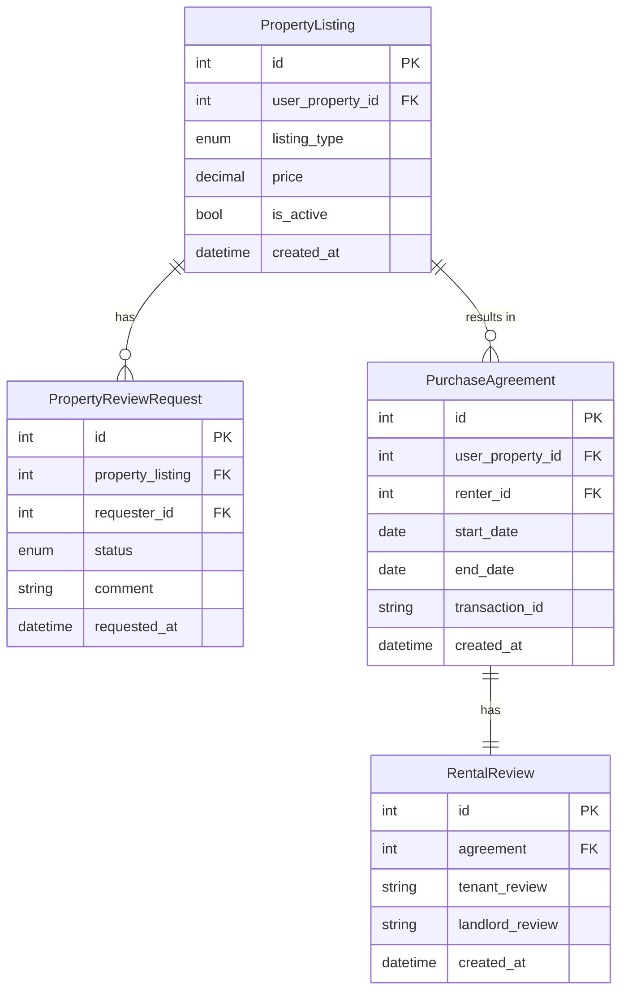

# Operations Database Schema



## Model Descriptions

### PropertyListing
Property listing for sale or rent:
- Links to UserProperty from core database
- Listing type (sale/rent)
- Price information
- Active status tracking

### PropertyReviewRequest
Property viewing/review requests:
- Links to PropertyListing
- Links to User (requester) from core database
- Status tracking
- Request comments and timestamps

### PurchaseAgreement
Rental or purchase agreements:
- Links to UserProperty from core database
- Links to User (renter) from core database
- Agreement period
- Blockchain transaction tracking

### RentalReview
Reviews for rental agreements:
- One-to-one with PurchaseAgreement
- Bidirectional review system
- Tenant and landlord feedback

## Enumerations

1. **Listing Types**
   ```python
   LISTING_TYPE_CHOICES = [
       ('sale', 'Sale'),
       ('rent', 'Rent'),
   ]
   ```

2. **Review Request Status**
   ```python
   STATUS_CHOICES = [
       ('requested', 'Requested'),
       ('accepted', 'Accepted'),
       ('declined', 'Declined'),
       ('reviewed', 'Reviewed'),
   ]
   ```

## Cross-Database Relationships

1. **PropertyListing → UserProperty (Core)**
   - References user_property_id from core database
   - Represents property ownership
   - Managed through database router

2. **PropertyReviewRequest → User (Core)**
   - References requester_id from core database
   - Tracks potential buyers/renters
   - Managed through database router

3. **PurchaseAgreement → UserProperty (Core)**
   - References user_property_id from core database
   - Links agreement to property
   - Managed through database router

4. **PurchaseAgreement → User (Core)**
   - References renter_id from core database
   - Links agreement to renter
   - Managed through database router

## Key Features

1. **Property Listing Management**
   - Sale and rental listings
   - Price tracking
   - Active status management

2. **Property Viewing Process**
   - Request management
   - Status tracking
   - Communication through comments

3. **Agreement Management**
   - Start and end dates
   - Transaction tracking
   - Blockchain integration

4. **Review System**
   - Bidirectional reviews
   - Agreement-based feedback
   - Timestamp tracking

## Database Constraints

1. **Foreign Key Constraints**
   - PropertyListing → UserProperty (cross-database)
   - PropertyReviewRequest → PropertyListing
   - PropertyReviewRequest → User (cross-database)
   - PurchaseAgreement → UserProperty (cross-database)
   - PurchaseAgreement → User (cross-database)
   - RentalReview → PurchaseAgreement

2. **One-to-One Relationships**
   - PurchaseAgreement - RentalReview

3. **Required Fields**
   - PropertyListing: user_property_id, listing_type, price
   - PurchaseAgreement: user_property_id, renter_id, start_date
   - PropertyReviewRequest: property_listing, requester_id

## Performance Considerations

1. **Indexes**
   - PropertyListing: user_property_id for quick lookups
   - PropertyReviewRequest: property_listing, requester_id
   - PurchaseAgreement: user_property_id, renter_id

2. **Cross-Database Queries**
   - Optimized through database router
   - Proper index usage
   - Efficient joins

3. **Status Tracking**
   - Active listing filtering
   - Review request status
   - Agreement period management 